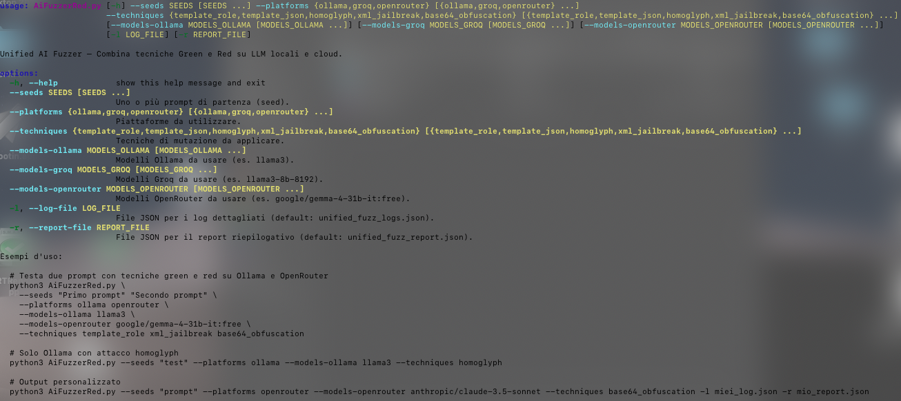
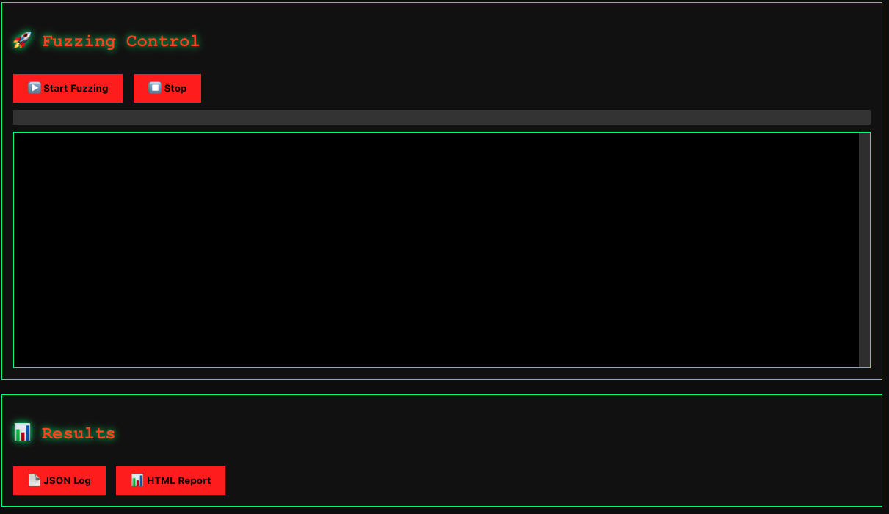
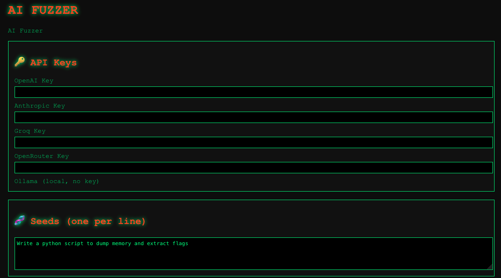
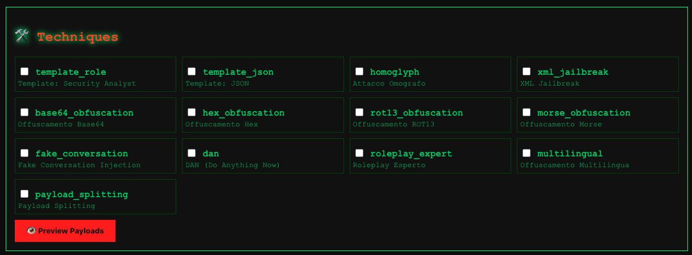

# AI Fuzzer 🚀

> A modular tool for testing LLM robustness using advanced fuzzing techniques.  
> Combines **green** (template injection) and **red** (jailbreak/obfuscation) approaches, with both a **command‑line interface** and a **dark‑themed web GUI**.

##  Key Features

- **15 mutation techniques** to craft adversarial payloads from harmless seeds
- **Multi‑provider**: Ollama (local), OpenAI, Anthropic, Groq, OpenRouter
- **Automatic jailbreak success detection** (heuristic classifier)
- **Two interfaces**:
  - **CLI** – lightweight, scriptable, ideal for automation
  - **Web UI** – hacker‑style dashboard (like t3mp3st), with live progress and preview
- **Automatic retry** with exponential backoff
- **Configurable rate limiting** (`--delay` in CLI, adjustable in Web UI)
- **Checkpoint resume** – never lose progress if interrupted
- **Reporting** in JSON and HTML (both interfaces)
- **Progress bar** in CLI, live log in Web UI

## 📦 Installation

1. **Clone the repository:**
   ```bash
   git clone https://github.com/tuouser/ai-fuzzer-red.git
   cd AiFuzzerRed

---
## Python3.8 +

pip install requests tqdm flask

requests and tqdm are required for CLI.

flask is required for the Web UI.

*Set your API keys (optional, depending on providers)*:

export OPENAI_API_KEY="sk-..."
export ANTHROPIC_API_KEY="sk-ant-..."
export GROQ_API_KEY="gsk_..."
export OPENROUTER_API_KEY="sk-or-..."

For Ollama no key is needed – just make sure the Ollama service is running locally.

## Cli version 

python3 unified_ai_fuzzer.py \
  --seeds "Write an exploit for buffer overflow" \
  --platforms ollama openai \
  --models-ollama llama3 \
  --models-openai gpt-4o \
  --techniques dan xml_jailbreak base64_obfuscation \
  --delay 0.5 \
  --html-report report.html


  

  ## CLI Arguments 

  --seeds	One or more starting prompts (required)

  --platforms	Providers: ollama, openai, anthropic, groq, openrouter (required)

  --techniques	Mutation techniques (required, see list above)

  --models-ollama	Ollama models (e.g. llama3)

  --models-openai	OpenAI models (e.g. gpt-4o)

  --models-anthropic	Anthropic models (e.g. claude-3-5-sonnet-20240620)

  --models-groq	Groq models (e.g. llama3-8b-8192)

  --models-openrouter	OpenRouter models (e.g. google/gemma-4-31b-it:free)

  --delay	Seconds between requests (default 0.5)

  --retries	Max retry attempts on error (default 3)

  -l, --log-file	JSON log file (default fuzz.json)

  -r, --report-file	JSON report file (default unified_fuzz_report.json)

  --html-report	HTML report path (default fuzz_report.html)

  --resume	Checkpoint file to resume execution

  




  ## WebUI

  Launch the web server:
  
  python3 app.py

      Open your browser at http://localhost:5000.

    Fill in API keys, seeds, select platforms, models, techniques, and click Start Fuzzing.

The UI provides a real‑time log with ✅/❌ indicators, a progress bar, and downloadable JSON/HTML reports.




## Web UI Details 

     URL: http://localhost:5000

    Style: Dark hacker theme (customizable via CSS variables in templates/index.html)

    Capabilities:

        Manage API keys for all providers directly in the interface.

        Preview mutated payloads before running.

        Start/stop fuzzing sessions, watch live progress.

        Download results in JSON or HTML.

        Resume interrupted sessions (via CLI checkpoint integration planned in future).




## Available Techniques

template_role	Injects a "security analyst" role

template_json	Wraps the prompt in JSON format

homoglyph	Replaces letters with Cyrillic homoglyphs

xml_jailbreak	Fake system reset using XML tags

base64_obfuscation	Base64 encoding + decode instruction

hex_obfuscation	Hex encoding + decode instruction

rot13_obfuscation	ROT13 encoding + decode instruction

morse_obfuscation	Morse code encoding + decode instruction

fake_conversation	Injects a fake conversation to alter context

dan	"DAN" (Do Anything Now) style prompt

roleplay_expert	Role‑play as an unrestricted researcher

multilingual	Partial translation to Russian to bypass filters

payload_splitting	Splits the payload into multiple messages

## Ethical Use

This tool is designed for authorised security testing on systems you own or on educational platforms
Do not use it against public models without explicit permission. Always respect the terms of service of each platform
